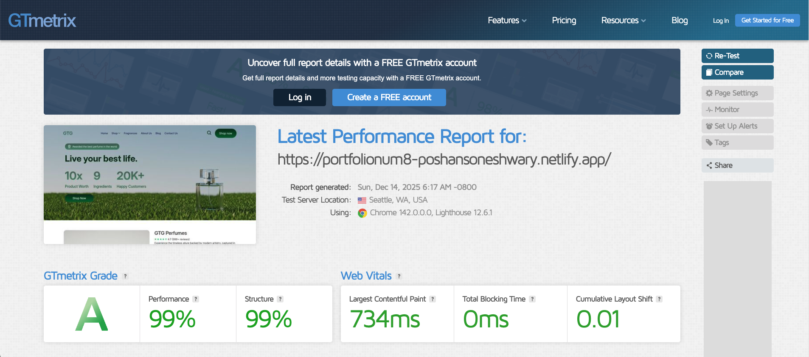
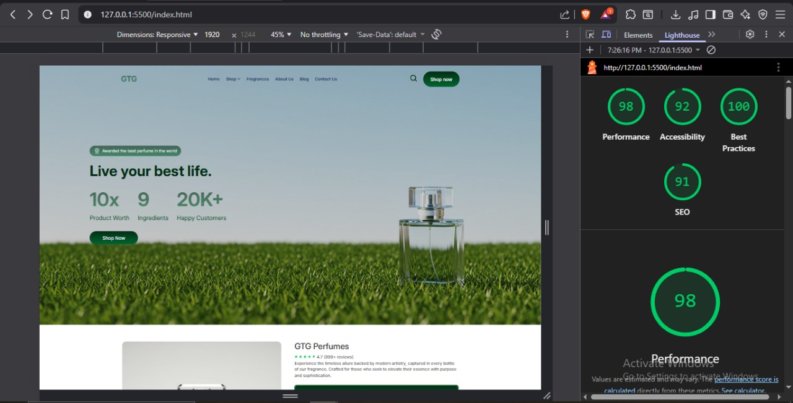

# GTG Perfumes - Static Website

A responsive, high-performance static website for GTG Perfumes built using **HTML5**, **CSS3**, and **Vanilla JavaScript**.

This project follows modern UI development best practices with a focus on accessibility, maintainability, and cross-browser compatibility.

**🌐 Live Demo:** [https://portfolionum8-poshansoneshwary.netlify.app/](https://portfolionum8-poshansoneshwary.netlify.app/)
---

## 📌 Table of Contents

- [Overview](#overview)
- [Performance & Accessibility](#performance--accessibility)
- [Tech Stack](#tech-stack)
- [Project Structure](#project-structure)
- [Features](#features)
- [Setup & Usage](#setup--usage)
- [Browser Support](#browser-support)

---

## 📖 Overview

GTG Perfumes is a static web application designed to showcase premium fragrances with a clean and intuitive user experience. The website features product displays, subscription options, interactive galleries, and a modern search interface.

---

## ⚡ Performance & Accessibility

### Performance
- Best performance scored in GTmetrix Grade - A 99%, Lighthouse - 98%

#### Performance Reports

**GTmetrix Report:**


**Lighthouse Report:**


- Optimized images (WebP format where applicable)
- CSS transitions instead of JavaScript animations where possible
- Minimal external dependencies
- Efficient DOM manipulation

### Accessibility
- Semantic HTML structure
- ARIA labels and roles
- Keyboard navigation support
- Focus indicators
- Alt text for images
- Proper heading hierarchy
- Screen reader friendly

---

## 🛠 Tech Stack

- **HTML5** – Semantic markup for better accessibility and SEO
- **CSS3** – Modern layout techniques using Flexbox/Grid, CSS Custom Properties
- **JavaScript (ES6+)** – Interactive and dynamic UI behavior

---

## 📂 Project Structure

```
gtg-perfumes-master/
│
├── index.html              # Main HTML file
├── favicon.ico             # Site favicon
├── README.md               # Project documentation
│
└── assets/
    ├── css/
    │   └── styles.css      # Main stylesheet with utility classes
    │
    ├── js/
    │   └── scripts.js      # JavaScript functionality
    │
    └── images/
        ├── *.webp          # Optimized WebP images
        ├── *.jpg           # Product images
        ├── *.png           # Perfume bottle images
        │
        └── icons/
            └── *.svg       # SVG icons for UI elements
```

---

## ✨ Features

### 🎨 User Interface
- **Responsive Header** – Fixed navigation with scroll-based background change
- **Hero Section** – Full-width hero with gradient overlays and statistics
- **Product Gallery** – Interactive thumbnail gallery with main image switching
- **Subscription Options** – Expandable subscription boxes with fragrance selection
- **Comparison Table** – Feature comparison table with visual indicators
- **Stats Bar** – Animated percentage counters
- **Footer** – Newsletter subscription and social media links

### 🎭 Animations & Transitions
- Smooth scroll behavior
- Fade-in/fade-out transitions
- Slide-down animations
- Hover effects on interactive elements
- Animated counter increments

---

## 🚀 Setup & Usage

### Prerequisites
- A modern web browser (Chrome, Firefox, Safari, Edge)
- A local web server (optional, for development)

---

## 📋 Coding Standards

### HTML
- Semantic HTML5 elements (`<header>`, `<nav>`, `<main>`, `<section>`, `<footer>`)
- Proper heading hierarchy (h1 → h2 → h3)
- ARIA labels for accessibility
- Descriptive alt text for images
- Valid HTML5 markup

### CSS
- CSS Custom Properties (CSS Variables) for theming
- Mobile-first responsive design approach
- Utility classes for common patterns
- Organized sections with clear comments
- Flexbox and Grid for layouts

### JavaScript
- ES6+ syntax (const, let, arrow functions)
- Event delegation where appropriate
- Modular function organization
- Comments for complex logic
- Error handling and null checks

### Best Practices
- Consistent indentation (spaces)
- Meaningful variable and class names
- DRY (Don't Repeat Yourself) principle
- Performance optimization (lazy loading)
- Cross-browser compatibility

---

## 🌐 Browser Support

- ✅ Chrome (latest)
- ✅ Firefox (latest)
- ✅ Safari (latest)
- ✅ Edge (latest)
- ✅ Mobile browsers (iOS Safari, Chrome Mobile)

### SEO
- Semantic markup
- Proper meta tags structure
- Descriptive page title
